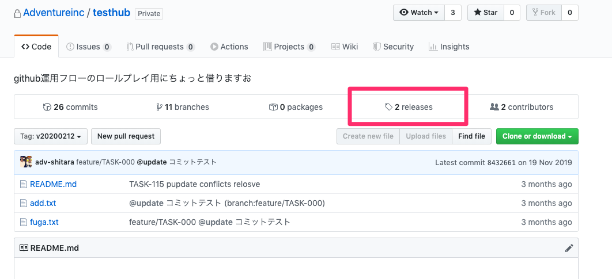
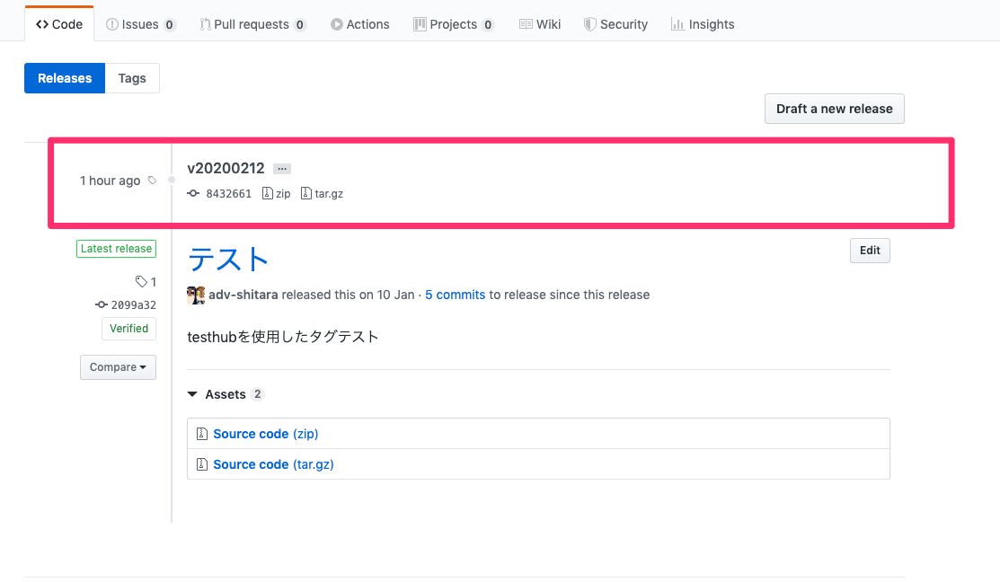

# skyticket pull request template

## 注意事項
「マージボタン」を押すと検証環境（ https://test.skyticket.jp/ ） に反映され、
翌日10時に本番にリリース(masterブランチに反映）されます。
動作確認やエラーの確認をした上で押してください。

------------------------------------------------------------------------------------

### 通常リリースの場合
- [ ] ブランチ名は**feature/TASK-++++** で作成しているか
- [ ] SPページ、PCページについて片方のみの修正ではなく両方共修正を行っているか
- [ ] SPページ、PCページについて片方のみの確認ではなく両方とも動作確認を行っているか
- [ ] LCC、非LCCについて片方のみの修正ではなく両方共修正を行っているか
- [ ] LCC、非LCCについて片方のみの確認ではなく両方とも動作確認を行っているか
- [ ] 開発環境での動作確認は済んでいるか（開発環境については専用の環境を使用してください
  - https://jp-fe01.skyticket.jp/
  - https://jp-fe02.skyticket.jp/
  - https://jp-fe03.skyticket.jp/
  - https://jp-fe04.skyticket.jp/
  - https://jp-fe05.skyticket.jp/
- [ ] スカイシーでのリリースは必要か
- [ ] PHPエラーは出ていないか（ /var/log/skyticket.com/error_log

------------------------------------------------------------------------------------

### 緊急リリースの場合（緊急リリースの場合、上記に加えて以下も確認してください
- [ ] ブランチは**hotfix/+++** で作成しているか
- [ ] chatworkにて開発に関わる人たちに周知しているか
- [ ] タグを作成しているか（タグを作成していないと、本番リリースを行えません
```
# タグの作成方法
git tag -a {tag_name} -m '{tag_comment}'
例：git tag -a v20200212 -m 'hotfix release'

# タグをリモートに反映する
git push origin {tag_name}
例：git push origin v20200212
```

#### 上記完了後、Chatworkにてデプロイ
タグと同時にリリースする必要があります。
タグを上記でリリースしていないと以下のデプロイが実行されないので注意してください。
```
# 検証環境にリリース
deploy: stg: skyticket: v20200212

# 本番環境にリリース
deploy: prd: skyticket: v20200212
```

#### リリースしたタグの確認方法



